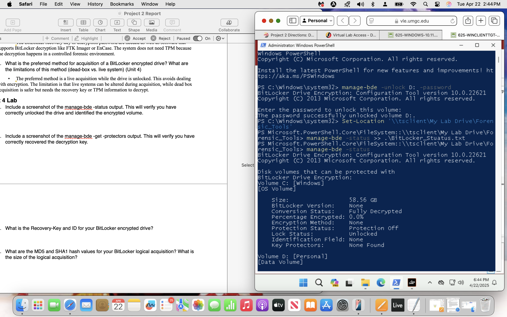
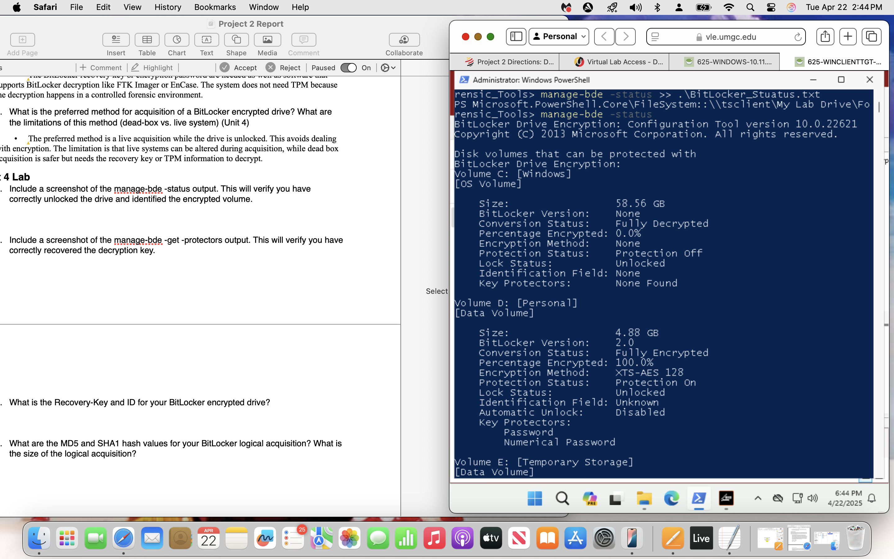
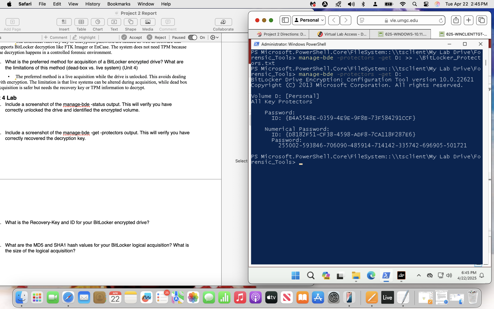
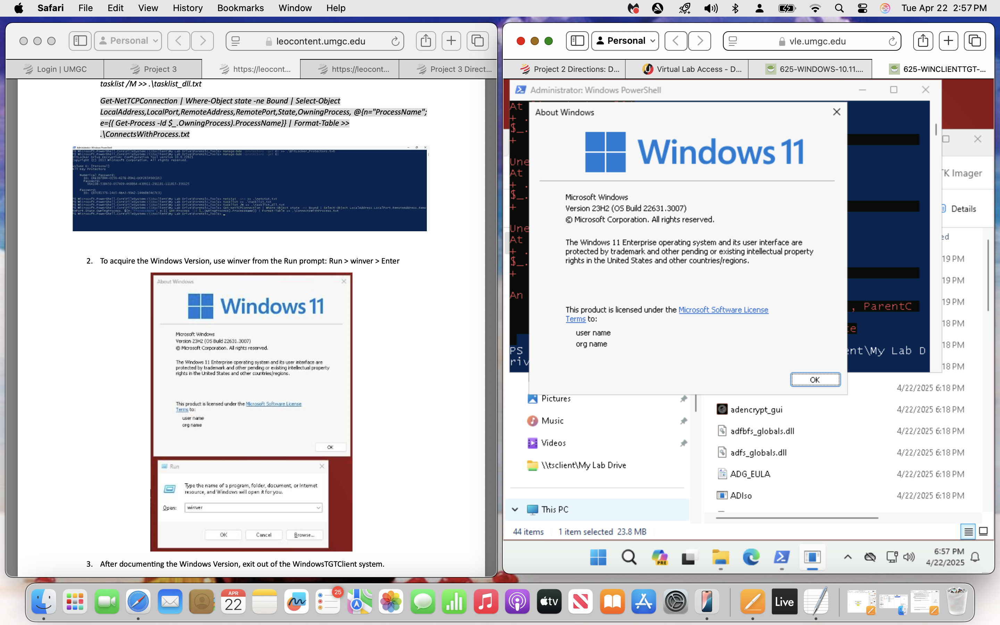
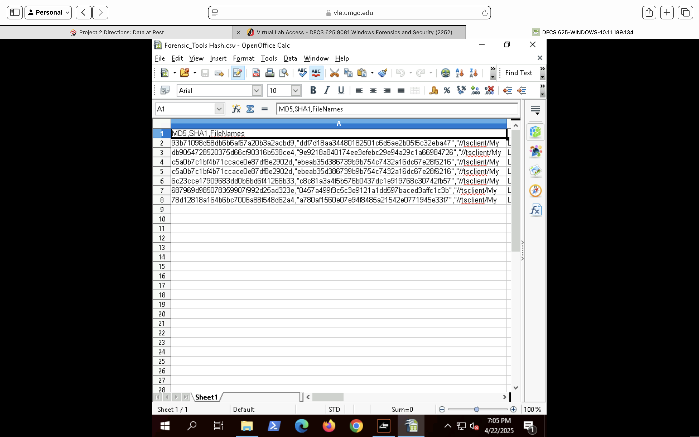
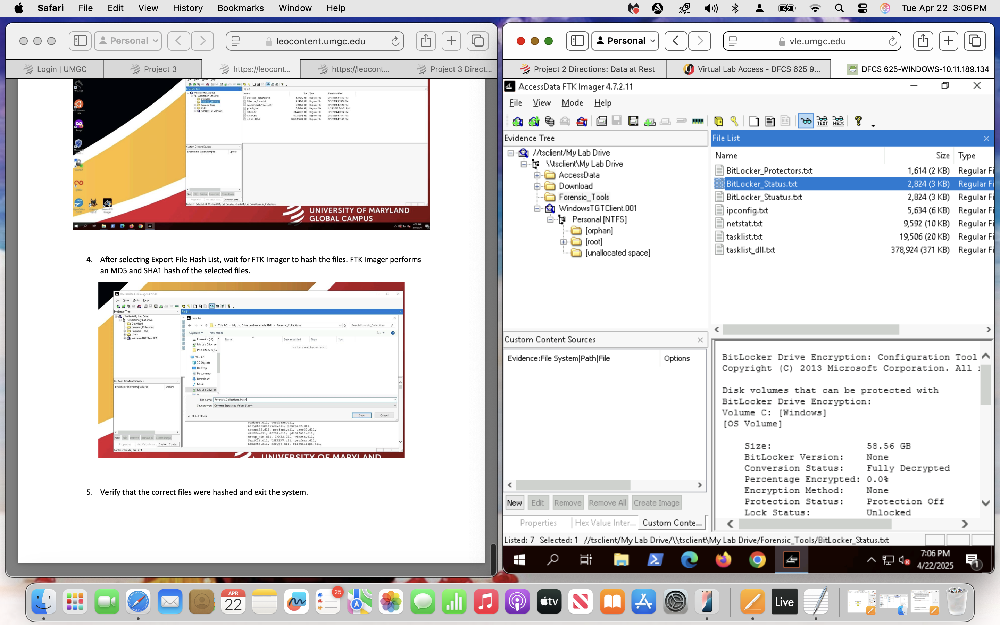

## BitLocker Encrypted Volume Identification

The encrypted volume was identified using the `manage-bde -status` command. This step confirmed the presence of a BitLocker-protected partition and documented the encryption configuration prior to evidence acquisition.

The output provided information regarding encryption status, protection settings, encryption method, lock status, and volume characteristics necessary for forensic planning and acquisition.

Further review of the volume status output confirmed that the Personal (D:) volume was fully encrypted using BitLocker with XTS-AES 128-bit encryption. The volume was successfully unlocked and available for forensic acquisition while maintaining encryption metadata for evidentiary purposes.

## BitLocker Recovery Key Identification

The BitLocker recovery key and protector identifiers were extracted using the `manage-bde -protectors -get` command. This process documented the available key protectors associated with the encrypted volume and provided the numerical recovery password required for forensic access.

Recovery key extraction is a critical step when examining encrypted storage devices because it enables investigators to access protected data while preserving evidentiary integrity and maintaining proper forensic procedures.

## Analysis Environment Documentation

The operating system used during forensic acquisition and analysis was documented to establish environmental context and support reproducibility of examination procedures.

The examination system was identified as Windows 11 Enterprise Version 23H2. Recording system specifications helps validate tool compatibility and provides context for future review of forensic findings.

## Hash Inventory Review

A comprehensive hash inventory was reviewed using OpenOffice Calc to verify completeness and document artifact-level integrity information. MD5 and SHA-1 hash values were recorded for acquired files and forensic artifacts to support future verification activities.

Review of the generated inventory confirmed that all acquired artifacts were successfully cataloged and associated with corresponding cryptographic hash values.

## Hash Inventory Review

A comprehensive hash inventory was reviewed using OpenOffice Calc to verify completeness and document artifact-level integrity information. MD5 and SHA-1 hash values were recorded for acquired files and forensic artifacts to support future verification activities.

Review of the generated inventory confirmed that all acquired artifacts were successfully cataloged and associated with corresponding cryptographic hash values.

## Acquired Artifact Review

The logical acquisition was reviewed using FTK Imager to verify that collected artifacts were successfully preserved within the forensic image. The examination confirmed the presence of BitLocker status information, recovery key documentation, network configuration data, active connection information, and process listings.

Reviewing acquired artifacts within the forensic image helps validate collection completeness and ensures that required evidence was successfully preserved for subsequent analysis.

